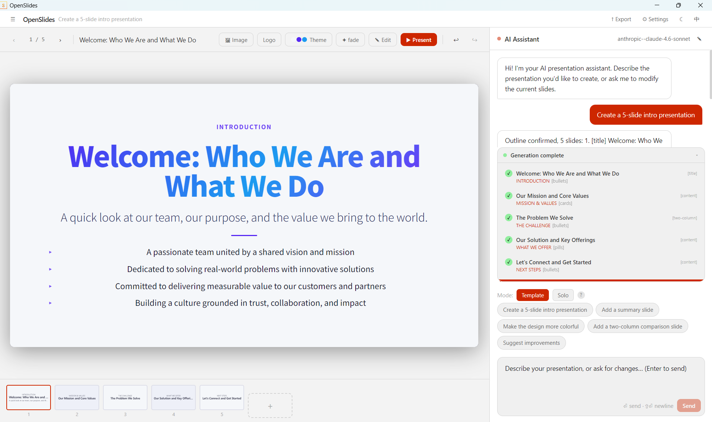

<p align="right">
  中文 | <a href="README.md">English</a>
</p>

<p align="center">
  
</p>

<h1 align="center">OpenSlides</h1>

<p align="center">
  基于 Electron 的 AI 驱动演示文稿编辑器。<br/>
  用自然语言描述你的需求，AI 逐页生成精美幻灯片——也可使用内置编辑器手动调整。
</p>

<p align="center">
  <a href="LICENSE"></a>
  
  
</p>

## 在线示例

> 以下示例均由 **claude-sonnet-4-6** 在 OpenSlides 中生成

- [介绍 OpenSlides — Solo 模式](https://chloeweever.github.io/OpenSlides/example/Introduce-OpenSlides.html)
- [介绍 GitHub — Solo 模式](https://chloeweever.github.io/OpenSlides/example/Introduce-Github.html)
- [AI 发展史 — Template 模式](https://chloeweever.github.io/OpenSlides/example/History-of-AI.html)

## 功能特性



- **AI 生成** — 用自然语言描述需求，AI 逐页生成完整演示文稿
- **两种生成模式**
  - **Template 模式** — AI 填充结构化布局（标题、内容、双栏、引用等），包含标题、要点、统计数据、卡片、图表等元素
  - **Solo 模式** — AI 将每张幻灯片设计为自由 HTML/CSS，视觉创意空间更大
- **实时预览** — 幻灯片在 iframe 沙箱中实时渲染
- **幻灯片编辑器** — 手动编辑布局、背景和各元素
- **颜色主题** — 每张幻灯片可独立切换内置配色方案
- **切换动效** — 每张幻灯片可设置滑动、淡入、缩放或无动效
- **品牌 Logo** — 在每张模板幻灯片上叠加 Logo，可配置位置、大小和透明度
- **图片插入** — 选取本地图片插入任意幻灯片
- **演示文稿管理** — 多个演示文稿本地保存，重启后自动恢复
- **HTML 导出** — 导出为可在任意浏览器中独立运行的单文件
- **深色 / 浅色模式** 与 **中 / 英** 语言切换

## 支持的 LLM 提供商

- OpenAI（GPT-4o、GPT-4 Turbo 等）
- Anthropic（Claude 3.5 Sonnet 等）
- 任意 OpenAI 兼容接口（Azure、Groq、本地 Ollama 等）

## 下载

Windows 和 macOS 的预构建安装包可在 [Releases 页面](https://github.com/ChloeWeever/OpenSlides/releases) 下载。

## 快速开始

### 环境要求

- [Node.js](https://nodejs.org/) 18+
- [npm](https://www.npmjs.com/)

### 安装与运行

```bash
git clone https://github.com/ChloeWeever/OpenSlides.git
cd OpenSlides
npm install
npm start
```

### 配置 AI

1. 点击顶栏的 **⚙ 设置**
2. 选择提供商（OpenAI / Anthropic / 自定义）
3. 填写 API Key 和模型名称
4. 点击 **保存设置**

## 项目结构

```
src/
├── main/
│   ├── main.js              # Electron 主进程入口
│   ├── ipc-handlers.js      # IPC 处理（LLM 调用、导出、会话）
│   ├── preload.js            # Context Bridge（渲染进程 ↔ 主进程）
│   ├── llm-client.js         # LLM API 客户端
│   ├── agent-client.js       # LangGraph 风格的幻灯片生成 Agent
│   └── store.js              # electron-store 封装
└── renderer/
    ├── index.html            # 应用壳层
    ├── css/app.css           # 主题变量与工具类
    ├── js/
    │   ├── i18n.js           # 中英文翻译
    │   ├── app.js            # 根 React 组件
    │   ├── slide-manager.js  # 幻灯片状态（撤销/重做、排序、操作）
    │   ├── chat-panel.js     # AI 聊天与生成流程
    │   ├── preview-panel.js  # 幻灯片预览工具栏
    │   ├── session-sidebar.js
    │   ├── settings-modal.js
    │   ├── export-modal.js
    │   ├── brand-logo-modal.js
    │   └── slide-editor.js   # 手动元素编辑器
    └── slide-frame/
        └── slide-frame.js    # 沙箱幻灯片渲染器（运行于 iframe 内）
```

## 打包构建

```bash
# Windows（NSIS 安装包 + 便携版 exe）
npm run make:win

# macOS（dmg + zip，x64 & arm64）
npm run make:mac

# 当前平台
npm run make
```

打包产物输出至 `dist/` 目录。

## 开源协议

GPL-3.0 © [Chloe Weever](https://github.com/ChloeWeever) — 详见 [LICENSE](LICENSE)。
